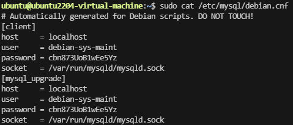

# Debian MySQL Installation

## Configure APT repository

```shell
wget https://repo.mysql.com//mysql-apt-config_0.8.33-1_all.deb
```

```shell
sudo dpkg -i mysql-apt-config_0.8.33-1_all.deb
```

```shell
sudo apt update
```

## Install MySQL

```shell
sudo apt-get install mysql-server
```

## Configure MySQL

```shell
mysql -uroot -p
```

enter root password

```sql
use mysql;
```

```sql
select User,host from user;
```

allow remote access

```sql
update user set host='%' where User = 'root';
```

refresh privilege, without restart mysql service

```sql
flush privileges;
```

create new user(based on demand, in this case to keep user same as system user debian) 

please change 'password' as you want

```sql
create user 'debian'@'%' identified with caching_sha2_password by "password";
```

grant privileges to new user, in this case, grant all privileges, you can grant different privileges to different users based on your needs.

```sql
grant all privileges on *.* to 'debian'@'%';
```

refresh privilege, without restart mysql service

```sql
flush privileges;
```

## Ubuntu additional configuration

Before configuring remote access, the precondition of it is mysql login access.

Since installation in using apt repository, almost every MySQL configuration steps including setting path, designate address,port, and generate default user are accomplished by predefined automatic procedure(sh file). User will not preceive the background processing.

Hence, Ubuntu need additional configuration.

To get the default user and password generate by MySQL

[Reference]([MySQL :: MySQL 8.4 Reference Manual :: 6.2.2.2 Using Option Files](https://dev.mysql.com/doc/refman/8.4/en/option-files.html))

```shell
sudo cat /etc/mysql/debian.cnf
```

### Example debian.cnf



Use the user to login, it has all privileges.

Then modify root password

MySQL 8.0 provide new encryption method caching_sha2_password to improve password security.

can choose sha256_password, mysql_native_password as well. 

[Reference]([MySQL :: MySQL 8.0 Reference Manual :: 8.4.1.3 SHA-256 Pluggable Authentication](https://dev.mysql.com/doc/refman/8.0/en/sha256-pluggable-authentication.html))

```sql
use mysql;
alter user 'root'@'localhost' identified with caching_sha2_password by 'yourpassword';
flush privileges;
```

Then go to [obtain remote access](#Configure MySQL)
